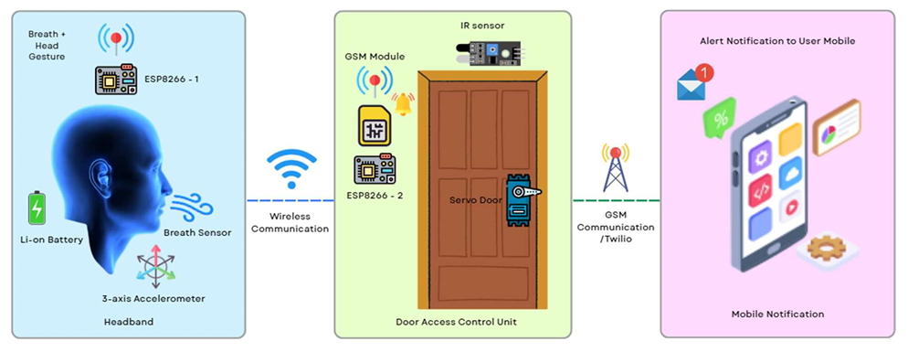
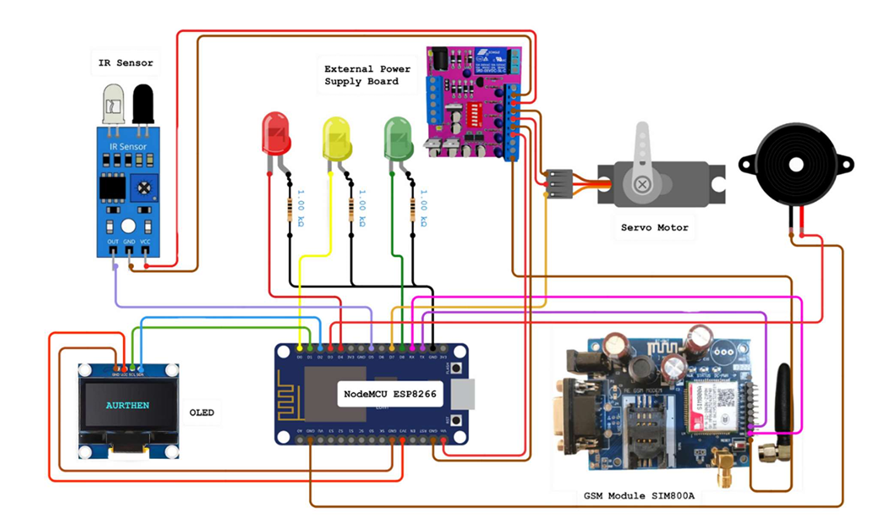
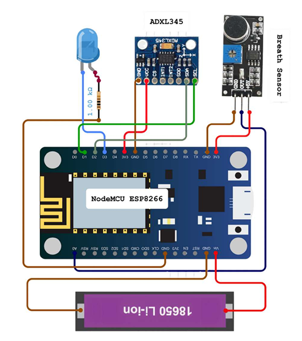
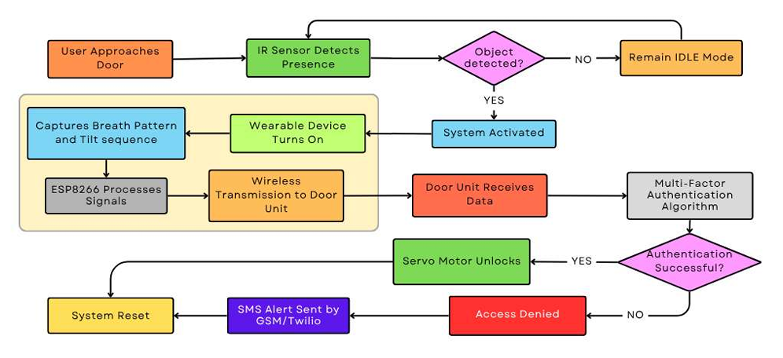
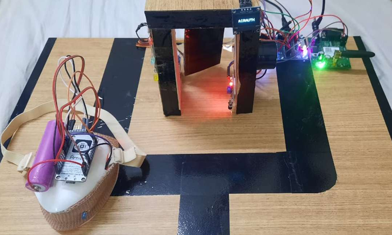

# 🛡️ AIRAUTH — Gesture-Based Mask Authentication Door System

> A contactless, IoT-powered door access control system that authenticates users via **head gestures + breath patterns** detected through a smart mask — built on two ESP8266 NodeMCU units communicating over WiFi UDP.

---

## 📸 Project Images


### Block Diagram


### Circuit Diagram

# Door Unit - Circuit Connection



# Mask Unit - Circuit Connection



### Workflow Diagram


### Hardware Setup


---

## ⚡ Circuit Connections

### Mask Unit (ESP8266 #2 — NodeMCU)

| Component       | ESP8266 Pin | Notes                          |
|-----------------|-------------|-------------------------------|
| ADXL345 SDA     | D2 (GPIO4)  | I2C Data                       |
| ADXL345 SCL     | D1 (GPIO5)  | I2C Clock                      |
| ADXL345 VCC     | 3.3V        |                                |
| ADXL345 GND     | GND         |                                |
| Breath Sensor   | A0          | Analog input (0–1023)          |
| Blue LED (+)    | D3 (GPIO0)  | 220Ω resistor in series        |
| Blue LED (-)    | GND         |                                |

### Door Unit (ESP8266 #1 — NodeMCU)

| Component       | ESP8266 Pin | Notes                          |
|-----------------|-------------|-------------------------------|
| IR Sensor OUT   | D5 (GPIO14) | LOW when object detected       |
| IR Sensor VCC   | 3.3V / 5V   |                                |
| IR Sensor GND   | GND         |                                |
| Servo Signal    | D7 (GPIO13) | PWM control                    |
| Servo VCC       | VIN (5V)    | Use external supply for load   |
| Servo GND       | GND         |                                |
| Buzzer (+)      | D3 (GPIO0)  |                                |
| Buzzer (-)      | GND         |                                |
| Green LED (+)   | D8 (GPIO15) | 220Ω resistor in series        |
| Red LED (+)     | D4 (GPIO2)  | 220Ω resistor in series        |
| Yellow LED (+)  | D0 (GPIO16) | 220Ω resistor in series        |
| All LED (-)     | GND         |                                |
| OLED SDA        | D2 (GPIO4)  | I2C Data (0x3C address)        |
| OLED SCL        | D1 (GPIO5)  | I2C Clock                      |
| OLED VCC        | 3.3V        |                                |
| OLED GND        | GND         |                                |

---

## 📦 Hardware Requirements

| Component                  | Qty | Notes |
|---------------------------|-----|-------|
| ESP8266 NodeMCU v1.0       | 2   | Mask Unit + Door Unit |
| ADXL345 Accelerometer      | 1   | Mask Unit |
| Flex / Piezo Breath Sensor | 1   | Mask Unit |
| HC-SR501 / IR Sensor       | 1   | Door Unit |
| SSD1306 OLED (128×64 I2C)  | 1   | Door Unit |
| SG90 Servo Motor           | 1   | Door Unit |
| Active Buzzer              | 1   | Door Unit |
| Blue LED                   | 1   | Mask Unit |
| Green LED                  | 1   | Door Unit |
| Red LED                    | 1   | Door Unit |
| Yellow LED                 | 1   | Door Unit |
| 220Ω Resistors             | 4   | For LEDs |
| Face Mask                  | 1   | To mount Mask Unit |
| Breadboard + Jumper Wires  | —   | |

---

## 🛠️ Software & Libraries

Install the following libraries in Arduino IDE:

```
ESP8266WiFi        (built-in with ESP8266 board package)
WiFiUdp            (built-in)
WiFiClientSecure   (built-in)
ESP8266HTTPClient  (built-in)
Wire               (built-in)
Adafruit ADXL345   → Install via Library Manager
Adafruit GFX       → Install via Library Manager
Adafruit SSD1306   → Install via Library Manager
Servo              → Install via Library Manager
```

**Board**: `NodeMCU 1.0 (ESP-12E Module)`  
**Board Manager URL**: `http://arduino.esp8266.com/stable/package_esp8266com_index.json`

---

## ⚙️ Configuration

Before uploading, edit these values in **both** `.ino` files:

### WiFi
```cpp
const char* ssid     = "YOUR_WIFI_SSID";
const char* password = "YOUR_WIFI_PASSWORD";
```

### Twilio SMS (Both Units)
```cpp
const char* accountSID  = "YOUR_TWILIO_ACCOUNT_SID";
const char* authToken   = "YOUR_TWILIO_AUTH_TOKEN";
const char* twilioFrom  = "+1XXXXXXXXXX";   // Twilio number
const char* twilioTo    = "+91XXXXXXXXXX";  // Your verified number
```

> ⚠️ Both units must be connected to the **same WiFi network** for UDP broadcast to work.

---

---

## 🔐 Authentication Sequence (Sample)

The user must perform the following gesture-breath pattern on the mask within **15 seconds**:

```
1. → Tilt Head RIGHT    (X acceleration < -4.0 g)
2. 💨 Take 2 Breaths    (breath sensor analog > 400, within 4s)
3. ↑ Hold Straight      (X acceleration near 0)
4. ← Tilt Head LEFT     (X acceleration > +4.0 g)
5. 💨 Take 2 Breaths    (same threshold)
6. ↑ Hold Straight      (final return)
```

Each step has a **5-second timeout**. Failure at any step triggers `AUTH_FAIL`.

---

## 🚨 Security Features

| Feature | Description |
|--------|-------------|
| **Fail Counter** | Tracks consecutive authentication failures |
| **SMS Alert** | Twilio SMS sent after 3 consecutive failures |
| **Lockout** | Door Unit locks for **30 seconds** after 3 failed attempts |
| **OLED Countdown** | Live countdown displayed during lockout |
| **Auth Timeout** | Auto-resets if no response within 20 seconds |
| **UDP Broadcast** | Local network only — no external exposure |

---

## 📡 UDP Communication Protocol

All messages sent on **port 4210** via WiFi UDP broadcast (`255.255.255.255`):

| Message       | Sender    | Meaning                        |
|---------------|-----------|-------------------------------|
| `MASK_ON`     | Door Unit | Person detected, begin auth    |
| `AUTH_OK`     | Mask Unit | Gesture sequence passed        |
| `AUTH_FAIL`   | Mask Unit | Gesture sequence failed        |

---

## 🚀 Getting Started

1. Clone this repository:
   ```bash
   git clone https://github.com/mohd-shameem-s/AIRAUTH.git
   ```

2. Open Arduino IDE and install required libraries.

3. Configure WiFi and Twilio credentials in both files.

4. Upload `MaskUnit.ino` → ESP8266 #2 (Mask Unit)

5. Upload `DoorUnit.ino` → ESP8266 #1 (Door Unit)

6. Power both units on the same WiFi network.

7. Approach the IR sensor → perform the gesture-breath sequence → door opens!

---

## 👤 Author

**Mohammed Shameem S ❤️**  
[GitHub](https://github.com/mohd-shameem-s) 

---

## 📜 License

This project is licensed under the [MIT License](LICENSE).

---

> 💡 **Tip**: For best breath detection results, use a flex sensor or piezoelectric sensor placed against the mask fabric. Adjust `breathPeakThreshold` in `MaskUnit.ino` based on your sensor's output range.
